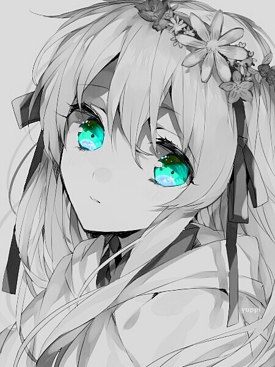
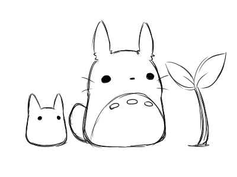

<div align="center">

# ~ 💖 𝓦𝓮𝓵𝓬𝓸𝓶𝓮 💖 ~


<div align="center">
  
</div>


## 🦊 ~ 𝓐𝓫𝓸𝓾𝓽 𝓶𝓮 ~ 🦊

</div>

```python
#!/usr/bin/python
# -*- coding: utf-8 -*-

class EndPointEngineer:

    def __init__(self):
        self.name = "Ferfields"
        self.role = "Endpoint Engineer"
        self.language_spoken = ["es_MX", "en_US"]
        self.specialties = [
            "Cybersecurity",
            "Red Team",
            "Ethical Hacker",
            "Security Analyst"
        ]
        self.preparing_for_certification = "EJPTv2"

    def say_hi(self):
        print("Thanks for visiting my profile :).")
        print(f"My name is {self.name}, and I am an {self.role}.")
        print("I specialize in the following areas:")
        for specialty in self.specialties:
            print(f"  - {specialty}")
        print(f"I am currently preparing for the {self.preparing_for_certification} certification.")
        print(f"I speak the following languages: {', '.join(self.language_spoken)}")

me = EndPointEngineer()
me.say_hi()
```

</div>


<div align="center">
    
##  ~ 📇 𝓚𝓷𝓸𝔀𝓵𝓮𝓭𝓰𝓮 📇 ~</h2>
</div>


<table>
  <tr>
    <td>
      
    </td>
    <td>
      <div align="center">
        <a href="https://git.io/typing-svg">
          
        </a>
      </div>
      <p align="center">
        <a href="https://skillicons.dev">
          
        </a>
      </p>
         <p align="center">
        <a href="https://skillicons.dev">
          
        </a>
      </p>
      <p align="center">
        <a href="https://skillicons.dev">
          
        </a>
      </p>
    </td>
  </tr>
</table>
<br>
<div align="center">
  


## 📝 ~ 𝓒𝓸𝓷𝓽𝓪𝓬𝓽 𝓶𝓮 ~ 📝</h2>

</div>


<p align="center">
  <a href="https://www.linkedin.com/" target="_blank">
    
  </a> &nbsp;&nbsp;
  
  <a href="" target="_blank">
    
  </a> &nbsp;&nbsp;
  
  <a href="mailto:ff@ferfields.me" target="_blank">
    
  </a> &nbsp;&nbsp;
  <a>
       <a href="https://discord.gg/" target="_blank">
    
      </a>
</p> 
    
<div align="center">
  
</div>
    


<div align="center">

## 💖 ~ 𝓣𝓱𝓪𝓷𝓴𝓼 𝓯𝓸𝓻 𝓻𝓮𝓪𝓭𝓲𝓷𝓰! ~ 💖

</div>


<table>
  <tr>
    <!-- Columna para el GIF -->
    <td>
      
    </td>
    <td align="center">
      
    </td>
  </tr>
</table>
<br>


